# gitsecrets

[](https://github.com/Octavian-Mihai/git-secret-scanner/actions/workflows/ci.yml)


**Finds the secrets you already deleted.** A mini gitleaks in pure Python (zero dependencies): regex rules +
entropy detection, scanned across your **entire git history**, and installable as a **pre-commit hook**.



Deleting a leaked key from the code doesn't remove it from git. `gitsecrets tree` says the repo is clean;
`gitsecrets history` shows the commit that introduced the key.

## Install

```bash
pipx install git+https://github.com/Octavian-Mihai/git-secret-scanner.git
# or, from a clone:
python3 -m pip install -e .
```

## Quickstart

```bash
gitsecrets history              # every commit on every branch (oldest first)
gitsecrets tree                 # current files
gitsecrets install-hook         # block commits that add a secret (bypass: git commit --no-verify)
```

Try it on a throwaway repo (the shell concatenation builds AWS's documented *example* key at runtime):

```bash
git init demo && cd demo
echo "AWS_KEY = \"AKIA\"\"IOSFODNN7EXAMPLE\"" > cfg.py   # shell joins the two halves
gitsecrets install-hook
git add cfg.py && git commit -m "oops"                   # blocked
```

Exit codes: `0` clean, `1` findings, `2` error. Options work before or after the subcommand.

| command | what it scans |
|---|---|
| `history [revs…]` | all commits on all refs (or a rev range, e.g. `main..feature`); `-j N` workers |
| `staged` | staged changes only (what the hook runs) |
| `tree` | current working files (tracked + untracked, honours `.gitignore`) |
| `baseline` | records current findings so later scans report only **new** ones |
| `install-hook` / `uninstall-hook` | manage `.git/hooks/pre-commit` (never overwrites a foreign hook without `--force`) |

Output: `--format text` (default, secrets redacted), `json` ([schema](docs/finding.schema.json)), or `sarif`
(GitHub code scanning). `-o FILE` writes to a file; `--show-secrets` unredacts; `--exit-zero` never fails.

## Adopting it on an existing repo: baselines

Old history will have findings you can't fix by rewriting history (public Firebase keys, test fixtures).
Accept them once, then only fail on new ones:

```bash
gitsecrets baseline             # writes .gitsecrets-baseline.json (commit it)
gitsecrets history              # -> only findings not in the baseline
```

Fingerprints are `sha256(rule, path, secret)`, so they survive line moves, rebases and re-commits.

## Configuration

Built-in rules live in [`gitsecrets/rules.toml`](gitsecrets/rules.toml). Per-repo overrides go in
`.gitsecrets.toml` (see this repo's own for a real example):

```toml
disable_rules = ["twilio-key"]

[[rules]]
id = "acme-token"
description = "Acme internal token"
regex = 'ACME-[0-9]{6}-[a-z]{4}'
keywords = ["acme-"]            # cheap prefilter: regex only runs on lines containing one
min_entropy = 2.5               # optional
allowlist = ['EXAMPLE']         # optional: regexes that suppress a match

[entropy]
enabled = true
b64_threshold = 4.2
hex_threshold = 3.0
decode_base64 = true

[allowlist]
paths = ["tests/*", "docs/*"]
regexes = ['^dummy_']
```

Other ways to silence a finding: `gitsecrets:ignore` in a comment on the line, a `.gitsecretsignore` file of
path globs, or `--ignore GLOB`. `node_modules/`, `vendor/`, lockfiles and binaries are skipped by default.

## Verification (opt-in)

`--verify` checks GitHub, Slack and Stripe findings against the provider's read-only API and reports
`LIVE` / `inactive` / unverified. **This sends the candidate secret to that provider**, so it is off by default
and prints a notice when used. A `LIVE` result means rotate immediately.

## CI integration

**pre-commit framework** (`.pre-commit-config.yaml`):

```yaml
repos:
  - repo: https://github.com/Octavian-Mihai/git-secret-scanner
    rev: v0.2.0
    hooks:
      - id: gitsecrets
```

**GitHub Action** (full history needs `fetch-depth: 0`):

```yaml
- uses: actions/checkout@v4
  with: { fetch-depth: 0 }
- uses: Octavian-Mihai/git-secret-scanner@v0.2.0
  with: { args: history }
```

For findings in the repo's Security tab, see [`code-scanning.yml`](.github/workflows/code-scanning.yml)
(SARIF upload). A client-side hook can always be skipped with `--no-verify`; the CI job is the real gate.

## How well does it work?

Measured by `python -m benchmarks.evaluate` against a labelled corpus
([`benchmarks/corpus.py`](benchmarks/corpus.py)): 34 positives covering every rule (plus base64-encoded secrets)
and 50 hard negatives (git SHAs, md5/sha256, lockfile integrity hashes, UUIDs, data URIs, placeholders, env
lookups, identifiers, paths, test fixtures).

| | |
|---|---|
| precision | **100%** (0 false positives / 50 negatives) |
| recall | **100%** (34 / 34) |

**Read those numbers sceptically**: the corpus is small, hand-written, and was used to tune the detectors (the
first run had a false positive, `HmacSHA256`, and 89% recall on short random strings; both were fixed against
it). It's a regression gate (`tests/test_corpus.py`), not an independent benchmark. The
[Meal-Planner experiment](#field-test) below is the better evidence.

**Why the default entropy threshold is 4.2 bits/char.** Sweep on 500 random 24-48 char strings vs. 500
identifier-like strings (camelCase, snake_case, kebab-case, paths):

| b64 threshold | recall | precision |
|---|---|---|
| 3.5 | 99.4% | 64.6% |
| 3.8 | 99.4% | 80.9% |
| 4.0 | 98.6% | 95.4% |
| **4.2** | **94.6%** | **99.8%** |
| 4.3 | 89.0% | 100.0% |
| 4.5 | 69.4% | 100.0% |
| 4.8 | 29.2% | 100.0% |

Short random strings can't reach high entropy (a 24-char string maxes out near 4.2), which is why 4.3 lost
recall. The synthetic negatives are easier than real code, so real-world precision will be lower.

### Field test

A real 236-commit project (Meal-Planner), same repo scanned with three versions:

| | v0.1.0 as first released | v0.1 + `node_modules` skip | v0.2 |
|---|---|---|---|
| findings | 38 (25 from a committed `node_modules/`) | 13 | 11 |
| scan time (best of 3) | not measured (about 21 s in a single run) | 10.7 s | 0.9 s |

Speed comes mainly from asking git not to diff `node_modules/`/`vendor/` at all (pathspec excludes), plus a
per-rule keyword prefilter. Parallel workers (`-j`) made no measurable difference on this repo because one huge
commit dominates; I haven't measured a repo where they help.

## How it compares

| | gitsecrets | gitleaks | trufflehog |
|---|---|---|---|
| language / deps | Python, none | Go binary | Go binary |
| history scan, pre-commit, SARIF, baseline | ✅ | ✅ | ✅ |
| live verification | 3 providers, opt-in | no | many providers, core feature |
| rule coverage | ~17 rules | hundreds | hundreds |
| speed on very large repos | untested; Python | fast | fast |

Use gitleaks or trufflehog for production coverage. This project is a compact, readable implementation of the
same ideas (about 1,000 lines), and a good base if you want something hackable. I haven't benchmarked it
against those tools, so no head-to-head numbers are claimed.

## Design decisions

- **Oldest-first history walk.** A secret is reported once, at the commit that *introduced* it, which is the
  commit you have to remediate.
- **Hunk-aware diff parsing.** Hunk headers say how many lines follow, so an added line like `++ x` (shown by
  git as `+++ x`) is never mistaken for a file header. Paths with spaces/quotes are unquoted properly.
- **Hex needs context.** A 40-char hex string is a git SHA far more often than a key, so standalone hex is
  ignored; hex only counts when assigned to a secret-looking name (`api_key = …`). Base64-ish tokens must also
  contain a digit and a letter, and `sha512-…` integrity hashes / `data:` URIs are excluded.
- **Specific rules beat generic ones.** Detectors run most-specific first and a later hit is dropped if its
  secret is already covered (e.g. `sk-ant-…` is an Anthropic key, not an "OpenAI key").
- **Base64 decoding.** Blobs are decoded and re-scanned (`github-token+base64`), one level deep.
- **Keyword prefilter.** Each rule declares cheap keywords so its regex only runs on candidate lines.
- **Redacted by default**, SARIF never contains the secret.

## Security notes

- **Revoke, don't just delete.** A key in git history is compromised even if the commit is later removed;
  rotate it first, clean history second (if at all).
- Output is redacted by default. `--show-secrets` and `--verify` deliberately handle real secrets; treat the
  terminal output and any report files accordingly.
- The tool is a best-effort heuristic scanner, not a guarantee. Absence of findings is not proof of absence.

## Limitations

- Secrets inside compressed/binary files and non-UTF-8 encodings are not scanned.
- Base64 decoding is one level deep; other encodings (hex, URL-encoding) are not decoded.
- Lines over 2,000 characters get regex rules only (no entropy); over 100,000 characters are truncated.
- Context-free hex keys (e.g. a bare 32-char hex API key with no telltale name) are missed by design.
- Added/modified lines only: it finds secrets *introduced* in history, not ones whose only trace is a
  deletion.
- Rule set is small (~17); add your own in `.gitsecrets.toml`.

## Development

```bash
python3 -m pip install -e ".[dev]"
python3 -m unittest discover tests     # 50+ tests
ruff check . && mypy
python3 -m benchmarks.evaluate         # precision/recall + threshold sweep
python3 scripts/make_demo_svg.py       # regenerate docs/demo.svg from a real run
```

Every false positive or miss you fix should become a line in `benchmarks/corpus.py`.
See [CHANGELOG.md](CHANGELOG.md). MIT licensed.
