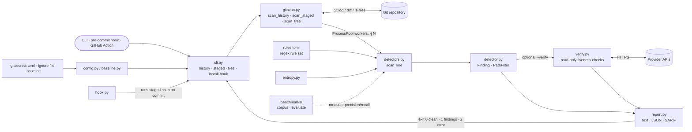

# Architecture

`gitsecrets` scans the working tree, staged changes, or the entire git history for secrets using regex rules plus entropy, and can run as a pre-commit hook. Pure Python, no dependencies.

